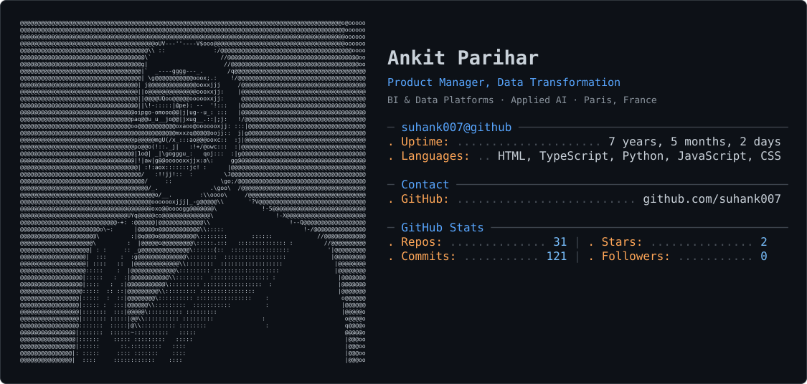

<picture>
  <source media="(prefers-color-scheme: dark)" srcset="dark_mode.svg" />
  <source media="(prefers-color-scheme: light)" srcset="light_mode.svg" />
  
</picture>

  

<h3><code>Contributions</code></h3>

  

<h3><code>Whoami</code></h3>

<table>
<tr>
<td valign="top"></td>
<td valign="top"></td>
</tr>
</table>

 

<h3><code>Career --Timeline</code></h3>

  

<h3><code>Impact --metrics</code></h3>

  

<h3><code>Education</code></h3>

  

<h3><code>Skills</code></h3>

  

<h3><code>Contact</code></h3>

<a href="https://linkedin.com/in/futureishere">LinkedIn</a> &nbsp;·&nbsp; <a href="https://bivonix.com">Bivonix</a> &nbsp;·&nbsp; <a href="https://suhank007.github.io/">Portfolio</a>

