<h3><code>./Contributions.sh</code></h3>

  

<h3><code>$ whoami</code></h3>

<table>
<tr>
<td valign="top"></td>
<td valign="top"></td>
</tr>
</table>

 

<h3><code>$ career --timeline</code></h3>

  

<h3><code>$ impact --metrics</code></h3>

  

<h3><code>$ cat contact.txt</code></h3>

<a href="https://linkedin.com/in/futureishere">LinkedIn</a> &nbsp;·&nbsp; <a href="https://bivonix.com">Bivonix</a> &nbsp;·&nbsp; <a href="https://suhank007.github.io/">Portfolio</a>

