  

<table>
<tr>
<td valign="top"></td>
<td valign="top"></td>
</tr>
</table>

 

<h3><code>avi@github ~ $ cat contact.txt</code></h3>

<a href="https://linkedin.com/in/futureishere">LinkedIn</a> &nbsp;·&nbsp; <a href="https://bivonix.com">Bivonix</a>

