<h1>Hi, I’m Ankit Parihar 👋</h1>

<h3>Data & AI · Product Strategy · Digital Transformation</h3>

I turn complex data into clear decisions—and ideas into working products.
 
Connecting business strategy, analytics, AI and product lifecycle management.

  

<a href="https://bivonix.com">Bivonix</a>
&nbsp;·&nbsp;
<a href="https://suhank007.github.io/">Portfolio</a>
&nbsp;·&nbsp;
<a href="https://linkedin.com/in/futureishere">LinkedIn</a>

Based in Paris · Open to global collaboration

 

<picture>
  <source media="(prefers-color-scheme: dark)" srcset="./dark_mode.svg" />
  <source media="(prefers-color-scheme: light)" srcset="./light_mode.svg" />
  
</picture>

---

## From business questions to useful products

My work sits where **data, technology and business decisions meet**.
I translate stakeholder needs into data products, reporting solutions
and practical AI applications.

- **Data & analytics:** pipelines, models and dashboards that make information usable.
- **PLM & manufacturing:** product structures, BOMs, data quality and governance.
- **Applied AI:** assistants, connected knowledge and tools that support decisions.
- **Product delivery:** turning requirements into priorities, prototypes and outcomes.

## What I’m building

<table>
  <tr>
    <td width="50%" valign="top">
      <h3>🌍 TerraScope AI</h3>
      

        A global intelligence platform bringing earthquakes, weather,
        air quality, wildfires and flights into one interactive globe,
        with an AI copilot.
      

      
<strong>Focus:</strong> geospatial data · live analytics · AI

      <a href="https://github.com/suhank007/terrascope-ai">Explore the repository →</a>
    </td>
    <td width="50%" valign="top">
      <h3>🔗 GeoTwin AI</h3>
      

        An early-stage decision intelligence prototype exploring AI agents,
        knowledge graphs and digital twins, starting with manufacturing
        data quality.
      

      
<strong>Focus:</strong> manufacturing · connected data · decision support

      <a href="https://github.com/suhank007/GeoTwin-AI">Explore the prototype →</a>
    </td>
  </tr>
  <tr>
    <td width="50%" valign="top">
      <h3>✨ Portfolio Builder</h3>
      

        An AI-powered personal branding platform that turns a résumé
        into an individual, editorial-style portfolio.
      

      
<strong>Focus:</strong> generative AI · personal branding · web products

      <a href="https://github.com/suhank007/portfolio-builder">Explore the repository →</a>
    </td>
    <td width="50%" valign="top">
      <h3>♟️ Tech-Tac-Toe</h3>
      

        A familiar game with a Claude-powered opponent,
        built as a Streamlit application using clean architecture.
      

      
<strong>Focus:</strong> LLM integration · Python · interactive apps

      <a href="https://github.com/suhank007/tech-tac-toe">Explore the repository →</a>
    </td>
  </tr>
</table>

## How I approach the work

**Understand the decision → assess the data → build something useful → iterate.**

I start with the business problem, make assumptions explicit and keep
the people using the solution involved throughout delivery.

Through **[Bivonix](https://bivonix.com)**, I bring together data consulting,
AI analytics and digital product development.

## My toolkit

| Area | Technologies |
| --- | --- |
| Analytics & BI | Power BI · SQL · KPI design · Reporting |
| Data platforms | Databricks · Snowflake · Azure · dbt |
| Product & manufacturing | ENOVIA · 3DEXPERIENCE · PLM · BOM data |
| AI applications | Claude · RAG · MCP · LangGraph |
| Development | Python · Streamlit · GitHub · Web applications |

## Experience & impact

My experience connects consulting, analytics and product transformation,
with work across manufacturing, aviation, insurance and pharmaceuticals.

  

  

## Learning & foundations

## Building in public

This profile brings together experiments, prototypes and evolving products.
Each repository is a chance to turn a question into something testable.

  

---

<h3>Have a data challenge or a product idea?</h3>

Let’s discuss data products, applied AI, manufacturing intelligence
or a useful tool worth building.

<a href="https://linkedin.com/in/futureishere">Connect on LinkedIn</a>
&nbsp;·&nbsp;
<a href="https://bivonix.com">Explore Bivonix</a>
&nbsp;·&nbsp;
<a href="https://suhank007.github.io/">View my portfolio</a>

  

Business context. Thoughtful engineering. Useful outcomes.

